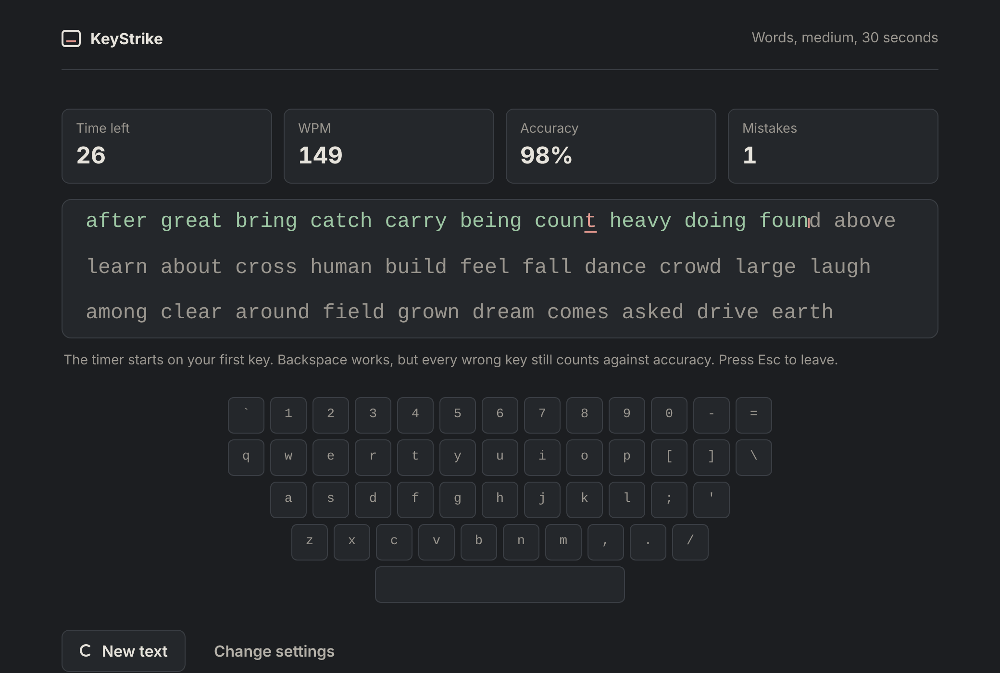

# KeyStrike

A typing speed test. Pick what to type and for how long, then type until the
timer runs out. Your best scores stay in the browser.



Plain HTML, CSS, and JavaScript. No libraries, no build step.

Live demo: https://mrmerozz.github.io/keystrike/

## What you can practice

| Text | Easy | Medium | Hard |
|---|---|---|---|
| Words | Short common words | Common words, mostly five letters | Long words like `authentication` |
| Quote | Short sayings | Longer quotes | Full sentences |
| Code | JavaScript keywords | One line snippets | Longer functions |
| Numbers | Whole numbers | Decimals and thousands | IP addresses and sums |
| Symbols | Contractions | Quoted phrases | Brackets and semicolons |

Tests run for 15, 30, or 60 seconds. Quotes end when you finish the quote.

## How scoring works

- **WPM** is correct characters divided by 5, per minute of real typing time.
  Wrong characters do not count toward speed.
- **Accuracy** counts every key you pressed. Backspace lets you fix a mistake,
  but the wrong key still counts against you.
- The timer starts on your first key, not when the page opens.
- Pasting and moving the cursor are blocked, so a score can only come from typing.

The ten best runs are saved in `localStorage` and the top five show on the
home page.

## Running it

Download or clone the repository and open `index.html` in any current
browser. Nothing to install. Press Esc during a test to go back to the
settings.

## Put it online with GitHub Pages

1. Push this folder to a GitHub repository named `keystrike`.
2. On GitHub, open the repository, then go to **Settings**, then **Pages**.
3. Under **Build and deployment**, set **Source** to **Deploy from a branch**.
4. Pick the `main` branch and the `/ (root)` folder, then select **Save**.
5. Wait one to two minutes, then refresh the Pages screen. The site is live at
   `https://mrmerozz.github.io/keystrike/`.
6. Copy that address into the **Website** field of the repository's About box.

## Files

```
index.html     Settings and best scores
test.html      The test
result.html    Result of the last run
css/style.css  Styles, light and dark (follows the system setting)
js/config.js   Saved settings and scores
js/words.js    Word lists and the text builder
js/keyboard.js On-screen keyboard
js/test.js     Typing, timing, and scoring
js/home.js     Settings page
js/result.js   Result page
```

## License

MIT. See [LICENSE](LICENSE). You can use, change, and share the code, as long as the license notice stays with it.
